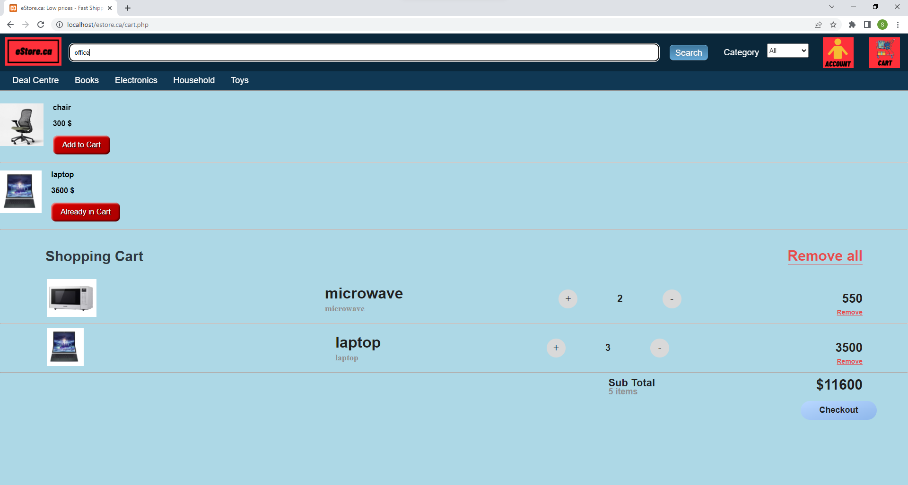

<h2>eStore (Online Marketplace) Application</h2>

<h2>Description of the Application</h2>

The web application that we built is an online marketplace. The web application allows customers to create accounts, browse items available for
sale in 4 categories (Books, Electronics, Household, and toys), and search for specific items and browse available items. The search function contains filters
(category of item) to help the user find an item. Items are added to cart using the "Add to Cart" button. The cart is saved in HTML5 local storage. Once an item
is added to the cart, the "Add to Cart" button is disabled and shows "Already in Cart" so the user knows what items are in cart. 
The quantity of items can be updated in the cart page. The user is also able to remove items individually or remove all items from the shopping cart. The checkout
 button mimics an actual checkout by displaying a confirmation page that displays an order number and a summary of the items purchased. The details of the order are
 stored in the orders table of the database. In order to check out, the user must be already logged in. If the user is not logged in, he/she will be directed to the
 login page where they can log in or register for a new account, after which the order is placed and the confirmation page is displayed. 
 The account page of the web application shows the details of the account (customer name, address fields, password, email).
 The user can update any of the account information fields (except the email which is the primary key of the account table) from this page by changing the value and
 pressing the "save profile" button. The order history of each user is also displayed below the account information fields in the account page.
 
HTML, CSS, JavaScript, and PHP are used for building the web app. A free external text similarity API (https://rapidapi.com/medel/api/text-similarity-calculator) is used
to determine the similarity between the search term and keywords provided for each item in the products table of the database. 
An internal API (navsearch.php) calls the external APT mentioned above and returns the result of the search query based on text similarity between the search term and
 keywords. The top portion of each page (below the navbar) is updated asynchronously with the products matching the search term. Please note the search function
is slow, especially when running the web app locally since we are using a free api and we have reached the query limit. There were more advanced, faster API's 
available but they were not free and required a subscription. 

<h2>Adherance to UI Design System</h2>
<li>
If you look at our <a href=</img>design system</a>, we used all the same fonts and colors. For this deliverable, we have just updated the layout of which the products are appearing the screen to be in a more neat and appealing fashion. As well as small improvements such as the updated "Add to Cart" button style.

</li>

<h2>Seeding Application with Sample Data</h2>
<li>The instructions for installing (running) the app locally are provided here <a href="INSTRUCTIONS FOR RUNNING LOCALLY.md">Instructions for Running the App Locally.</a> </li>
<li>The web application php files (for running the app locally) are in the "estore.ca" folder.</li>
<li>This also includes instructions on how to load the <a href=estore.ca/estore-3230388f1d.SQL>SQL sample data scripts</a> that is also provided to demonstrate seeding the application.</li>

<h2>Features of the Web Application and Screenshots</h2>
<ul>
<li>
Two products of each category have been added to the MySQL database. The index page shows all the products available for sale. The screenshots below show the Index,
 Electronics, and Deal Centre pages.

</img>
</img>
</img>

</li>
<li>
The user is able to create a new account from the register page. The register page can be reached by pressing the account logo on the top right of the navbar, which
redirects the user to the login page if the user is not already logged in. From the login page, the user can choose to register. The screenshots below show entering
the new user account information in the register page and the customers table of the database which is updated afterward.

</img>
</img>

</li>
<li>
After successful registration, the user is directed to the account page. The user is able to update account information fields or add the additional account information
 fields (address) from this page. This can be done by adding/updating the fields in the dual-purpose text fields and pressing the "Save Profile" button. The screenshots
below show the account page after registration and the account page after entering the address information fields and pressing the "Save Profile" button.

</img>
</img>

</li>
<li>
The user is able to log in to view account information. The login page can be reached by pressing the account logo on the top right of the navbar, which
redirects the user to the login page if the user is not already logged in. The accounts page displays account information fields and the order history of the customer,
 both of which are retrieved from the database. The user is able to update any of the account information fields by changing their values in the dual-purpose input
fields and pressing the "Save Profile" button. The user can log out by pressing the logout button, after which he/she is directed to the index page. The screenshots
 below show the login page, the account page, and the account page after updating the account information fields.
A screenshot of the database customers table is also included to confirm that the account information fields are updated in the database. Please note that the
email field cannot be updated since it is used as the primary key of the customer-accounts table.

</img>
</img>
</img>
</img>

</li>
<li>
The user can add items to the cart by pressing the "Add to Cart" button. The "Add to Cart" button is disabled after adding an item to the cart so the user knows which items
are already in the shopping cart. The cart page (which can be reached by pressing the cart button on the top right of the navbar) shows the items which have been
added to the cart. The user can update the quantity of items, remove items individually, or remove all items from the shopping cart. The screenshots below show the
how "Add to Cart" buttons are changed after adding items to the cart. A screenshot of the shopping cart (with updated quantities of items) is also included.

</img>
</img>

</li>
<li>
The user is able to check out by pressing the checkout button. The checkout button mimics an actual checkout by displaying a confirmation page that displays an order
 number and a summary of the items purchased. The details of the order are stored in the orders table of the database. In order to check out, the user must be already logged in. If the user is not logged in, he/she will be directed to the
 login page where they can log in or register for a new account, after which the order is placed and the confirmation page is displayed. The screenshots below show the
 checkout confirmation page and the account page of the customer after placing the order with updated order summary information.

</img>
</img>

</li>
<li>
The user is able to search for products by entering a keyword in the top navbar search box. The category of the item pertaining to the search can also be selected using
the drop-down field. As described above, an internal API (navsearch.php) calls an external text similarity APT and returns the result of the search query based on text
 similarity between the search term and keywords provided for products in the database. The top portion of each page (below the navbar) is updated asynchronously
 with the products matching the search term. An "Add to Cart" button with the functionalities described before is displayed below each item matching the search so
the user can add products matching their search to the cart. Please note that as described before, the search function is slow, especially when running the web app
 locally since we are using a free text similarity API and we have reached our query limits (it takes 10-20 seconds for search results to appear). The screenshots below show three samples of returned search results and the 
"Add to Cart" button after adding two of the items to the cart.

</img>
</img>
</img>
</li>
<li>
Products in the database:
</img>
</li>
</ul>

<h2>Testing</h2>
<li>
<a href="unittest1.php">unittest1.php</a> was used to test inserting a product into the database.
</li>
<li>
<a href="unittest2php">unittest2.php</a> was used to test inserting a customer account into the database.
</li>
<li>
When the test is successful, it will return "Good Query":

</img>
</li>
<li>
Inserting a new product test (hotwheels) using <a href="unittest1.php">unittest1.php.</a>:
</img>
</li>

